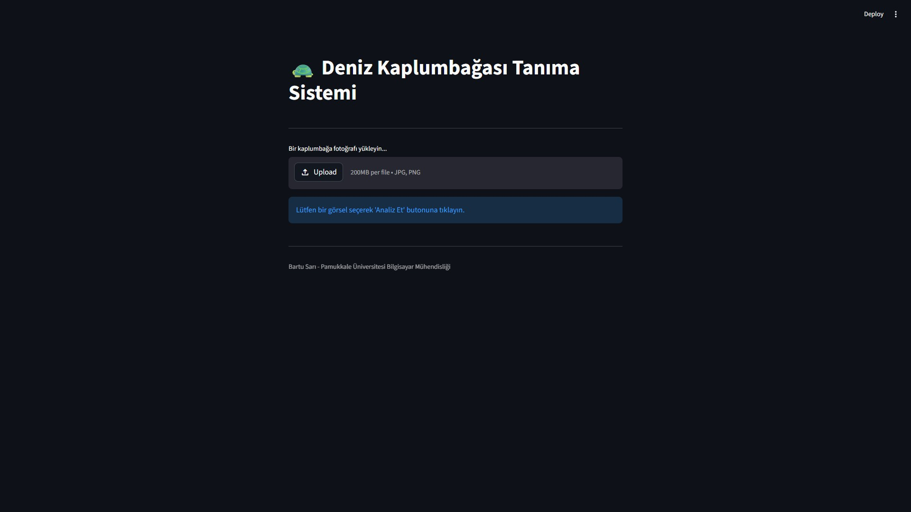
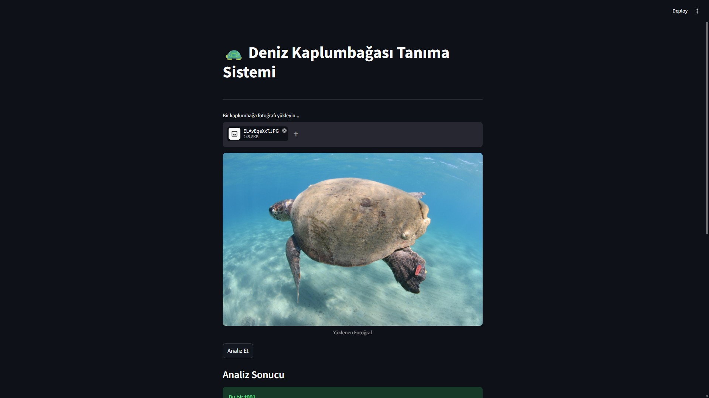
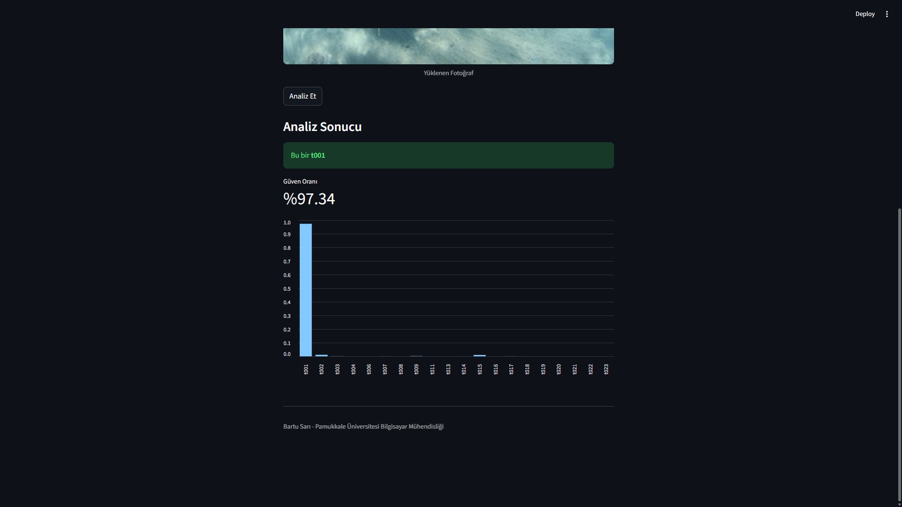

# 🐢 Sea Turtle Recognition System

Bu proje, **MobileNetV2** mimarisi ve **Transfer Learning** teknikleri kullanılarak geliştirilmiş, deniz kaplumbağası türlerini dijital görüntüler üzerinden tanımlamayı amaçlayan bir derin öğrenme projesidir. Sistem, yüksek doğruluk oranı ve kullanıcı dostu bir Web arayüzü (Streamlit) sunar.

## 📋 Proje Özeti

Deniz kaplumbağalarının korunması ve takibi süreçlerinde tür tayini kritik bir öneme sahiptir. Bu yazılım, karmaşık manuel tanımlama süreçlerini otomatize ederek araştırmacılara yardımcı olur. Başlangıçta Çoklu Ajan Sistemleri (Multi-Agent Systems) ile kurgulanan proje, teknik kararlılık adına derin öğrenme model eğitimi yöntemine revize edilmiştir.

## 📸 Ekran Görüntüleri


<br><br>

<br><br>


## 🚀 Öne Çıkan Özellikler

- **MobileNetV2 Mimarisi:** Düşük donanımlı cihazlarda bile yüksek performanslı çalışma.
- **Ağırlık Bazlı Yükleme:** Keras 3 uyumluluğu için geliştirilmiş güvenli model yükleme protokolü.
- **Dengesiz Veri Yönetimi:** `Class Weighting` yöntemiyle az bulunan türlerin doğru tanınması.
- **Görsel Analiz:** Streamlit tabanlı arayüz ile olasılık dağılım grafiklerinin sunulması.

## 🛠️ Kurulum ve Gereksinimler

Projenin çalışması için bilgisayarınızda Python 3.10+ yüklü olmalıdır.

1.  **Gerekli kütüphaneleri yükleyin:**

    ```bash
    py -m pip install tensorflow keras streamlit numpy pillow scikit-learn
    ```

2.  **Veri setini hazırlayın:**
    `dataset/` klasöründeki ham görüntüleri eğitim/doğrulama setlerine ayırmak için:
    ```bash
    python src/prepare_data.py
    ```

## 💻 Kullanım Talimatları

### 1. Modelin Eğitilmesi

Modeli eğitmek ve ağırlıkları (`.weights.h5`) oluşturmak için:

```bash
python src/train_ai.py
```

### 2. Web Arayüzünün Başlatılması

Eğitilen modeli kullanarak tahmin yapmak için Streamlit arayüzünü şu komutla çalıştırın:

```bash
py -m streamlit run src/app.py
```

## 📊 Eğitim Detayları

- Optimizer: Adam ($LR = 5e-5$)
- Loss: Sparse Categorical Crossentropy
- Callbacks: EarlyStopping (Patience: 10)
- Güven Eşiği: %50 (Threshold)

## 📁 Proje Yapısı

```Plaintext
SeaTurtleRecognition/
├── proje_data/                 # Bölünmüş veri seti (Train/Val/Test)
├── src/
│   ├── app.py                  # Streamlit Web arayüzü
│   ├── train_ai.py             # Eğitim scripti
│   ├── model_builder.py        # Model mimarisi
│   └── prepare_data.py         # Veri hazırlama aracı
├── turtle_weights.weights.h5   # Model ağırlıkları
└── class_names.pkl             # Sınıf isimleri
```
